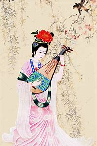

**《诗经•卫风•硕人》（先秦）**

手如柔荑，肤如凝脂，领如蝤蛴，齿如瓠犀，螓首蛾眉，巧笑倩兮，美目盼兮。

这是最早的关于美人的描写，后世多模仿。当时由于文字不丰富，所以用其它物品来比喻美人再恰好不过了，正是因为句子上没有华丽的装饰，使得美人之美更加真实生动。

**《李延年歌》•李延年（汉）**

[北方有佳人](诗经/碎碎念.html)，绝世而独立。

一顾倾人城，再顾倾人国。

宁不知倾城与倾国，佳人难再得。

姑娘太美，让人一见倾心，弃城亡国(ಡωಡ) 。

**《长恨歌》•白居易（唐）**

回眸一笑百媚生，六宫粉黛无颜色。

春寒赐浴华清池，温泉水滑洗凝脂。

......

风吹仙袂飘飖举，犹似霓裳羽衣舞。

玉容寂寞泪阑干，梨花一枝春带雨。

## 这是一个实验
 这是一个实验.....